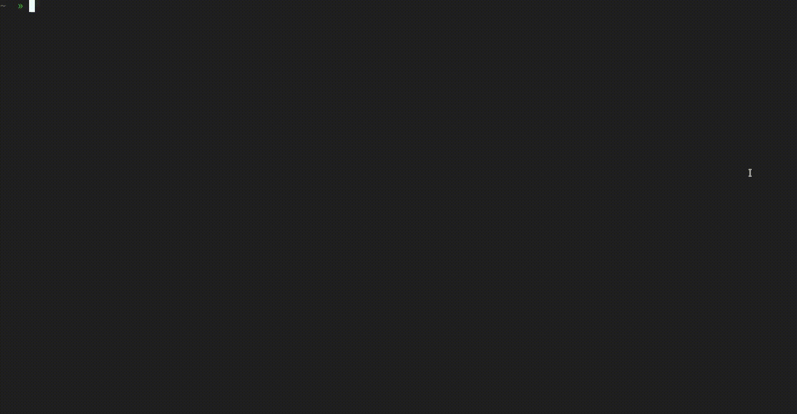

# TK-encoding

**Q: What up with the name?**

A: tk stands for *t*hree-*k*oding. Because it encodes in groups of three bytes. (I know the name sucks)

**Q: Wait, what do you mean with "encoding in groups of three bytes"?**

A: tk is an encoding and a program to convert ordinary files to png images. It's like a colorful version of hexdump.

**Q: Ok, so why would I ever want this? hexdump -C looks pretty fine to me**

A: Well, just compare the experiences:

Do you prefer this: 

Or this? 

You're missing out on this beauty!!!! Have you ever wondered what `vim` really looks like, behind that gray hexdump?? Get enlightened today!!!!

## The Gallery

This tool can create some really crispy **ART**. Just shove in some interesting file formats and watch the world in an entirely new way.


Check out that xls file... that's a wallpaper! This is embarrassing for Microsoft though, their file format is so inefficient that it shows patterns... It might be the reason for xlsx existance, that looks more compressed.

I didn't know before that pdf-files has this interesting header in the beginning, but now I know. Such an educational tool tk is! Plain text are pretty gray. That svg though, has some sick redundancy. The binary formats look pretty random, which is very reasonable.

## How to get it

The rusty way:

```bash
git clone https://github.com/MrYakobo/tk.git
cd tk
cargo install --path . # assuming ~/.cargo/bin is on PATH
strip -s $(which tk) # save some precious disk space
```

Or simply get a binary from the releases page [here](https://github.com/MrYakobo/tk/releases) and place that on PATH.

## Runtime dependencies

If you want to preview your lovely images with the `-p` flag, you need to have [this image viewer](https://github.com/eXeC64/imv) installed that can view using the nearest neighbors algorithm so that the pixel art stays crisp and won't get smudgy by some bilinear algorithm. If you don't, you risk smudge  and `-p` fall backs to `xdg-open`, whatever that might be.

## Usage examples

```bash
$ echo "some input" | tk encoded.png # encode some input
$ tk -p < /usr/bin/vim # preview how vim looks
$ cat /usr/bin/vim | gzip -c | tk -p # preview gzipped vim
$ tk file.xls -p # preview how an xls file looks
$ tk something.txt encoded.png # encode something.txt to encoded.png

$ tk encoded.png # decode an image
$ tk encoded.png output.txt # decode an image and dump output to file

$ head -c 1000 /dev/urandom | tk -d 16x9 wallpaper.png # make a random 16x9 wallpaper!
```

The `-d` flag changes the aspect ratio of the output image. Lovely invention for making those crispy non-square wallpapers.

A sharp eye notices from the examples above that you can decode an image as well. Yes, for the price of one program you also get decoding power! Syncing your whole OS to Google Photos has never been easier than now!!! Tutorial below:

1. `tar c / | tk OS.png`
2. Upload to GPhotos
3. Download the image
4. `tk OS.png | tar x -C /`

Whew lad! Not a single bit was flipped in that process, rest assured! Cause my gospel here is that `diff -q $(tar c / | sha1sum) $(tk OS.png | sha1sum); echo $?` outputs z-e-r-o. Facts.

## The TK Encoding

The TK-encoding is complete, in the sense that it can encode any vector of input to an image, and that can later be decoded back into the original vector. The program has been [fuzzed](https://github.com/rust-fuzz/cargo-fuzz), so this process is entirely lossless.

Anyhow, the encoding is very simple. Bytes are read 3-by-3 and turned into a pixel. The first byte is interpreted as the red channel in a pixel, the second is green and the third is blue.

Now, the sad truth lies in that not every file has a byte-count divisable by three, and our image size has to be a rectangle. Thus, some padding is required. The alpha-channel of a pixel tells us what "type" of padding that a pixel is.

- `0xFF`: Normal pixel, all channels are used.
- `0xFE`, `0xFD`, `0xFC`: The distance to 0xFF tells us how many channels that are padding channels, due to the divisable-by-three constraint.
- `0x0`: Filler pixel, used in the end of the image to pad out the rectangle.

## Formal Usage

**Flags**

    -p: preview the resulting png image in your xdg-open image viewer.
    -d "WxH": string, "Dimensions" of the resulting image. For example "16x9". This is only used for determining aspect ratio - you have to scale the image yourself afterwards. Defaults to 1x1 (square).

All possible combinations of usage of tk is shown below:

| cmdline                | piped | arg1 | arg2 | preview | method                              |
|------------------------|-------|------|------|---------|-------------------------------------|
| `echo "a" \| tk a.png` | true  | png  |      |  false  | `encode(stdin, arg1)`               |
| `echo "a" \| tk -p`    | true  |      |      |  true   | `encode(stdin, tmpfile); show(t)`   |
| `tk a.txt -p`          | false | txt  |      |  true   | `encode(txt, tmpfile); show(t)`     |
| `tk a.txt b.png`       | false | txt  | png  |  false  | `encode(txt, png)`                  |
| `tk a.png`             | false | png  |      |  false  | `decode(png)`                       |
| `tk a.png b.txt`       | false | png  | txt  |  false  | `decode(png, txt)`                  |

## License

MIT
